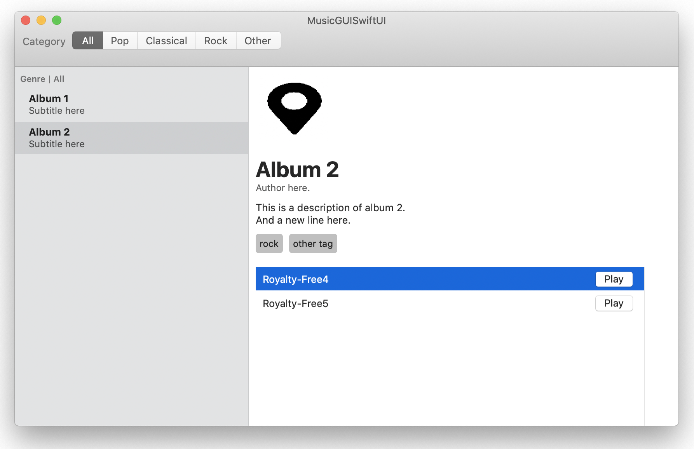

# MusicGUISwiftUI

A music app for macOS designed wholey in SwiftUI.

## This project is loosely based on code from Carson Katri's [reddit-swiftui project](https://github.com/carson-katri/reddit-swiftui) with the network code stripped out and repurposed to deal with local data. The watchOS/iOS counterparts were removed. This was made to experiment with the functionality of SwiftUI for macOS.
