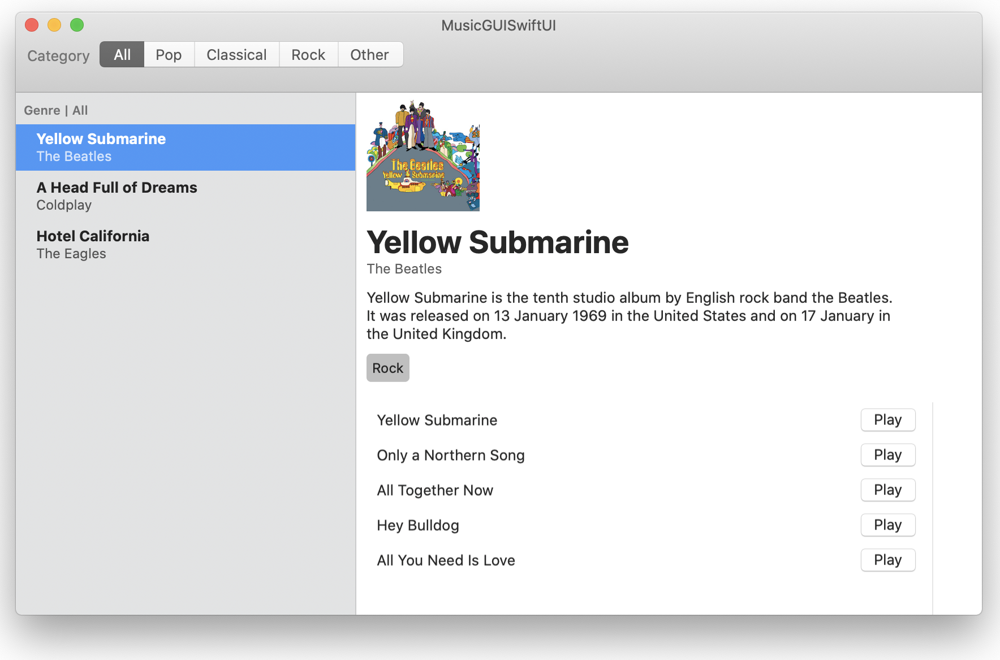

# MusicGUISwiftUI

A music app for macOS designed wholly in SwiftUI.

Here is what it looks like with a small music library:

This project is based on my repository [SwiftUIStarterKit](https://github.com/ByteSizeCode/SwiftUI-StarterKit) which is loosely based on code from Carson Katri's [reddit-swiftui](https://github.com/carson-katri/reddit-swiftui) project with the network code stripped out and repurposed to deal with local data.
